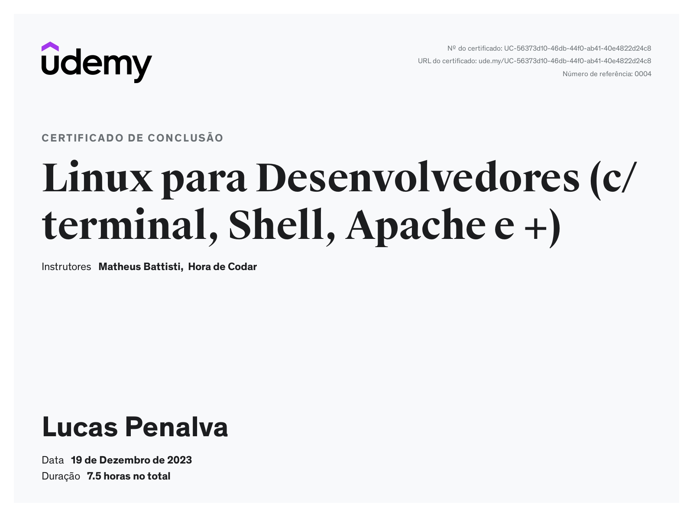
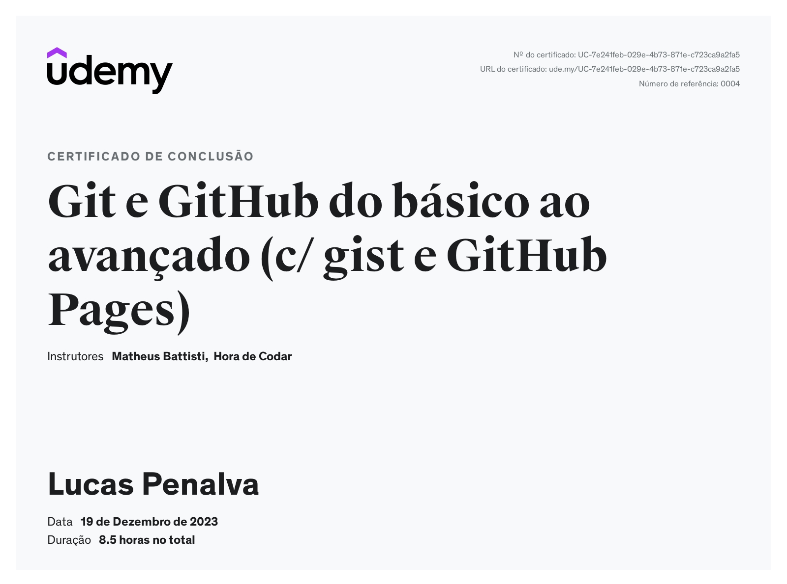

## Aprendizados

Na Sprint 1, desenvolvemos o conhecimento dos principais conceitos e comandos do sistema operacional Linux. Aprendemos de forma prática como executar diversos comandos, desde o gerenciamento, edição, atualização e permissão de diretórios e arquivos via linha de comando.

Além disso, aprendemos também sobre a ferramenta Git, muito utilizada no dia a dia dos desenvolvedores. Essa ferramenta, atua como um versionador de controle de códigos e arquivos. Nela podemos trabalhar em equipe, registrando, modificando e enviando todas as atualizações e mensagens necessárias, direto para um repositório de armazenamento remoto.

<!--# Exercícios

1. ...
[Resposta Ex1.](exercicios/ex1.txt)

2. ...
[Resposta Ex2.](exercicios/ex2.txt)

# Evidências

Ao executar o código do exercício ... observei que ... conforme podemos ver na imagem a seguir:

-->

## Certificados

_Certificado Linux para Desenvolvedores_

_Certificado Git e Github do básico ao avançado_

