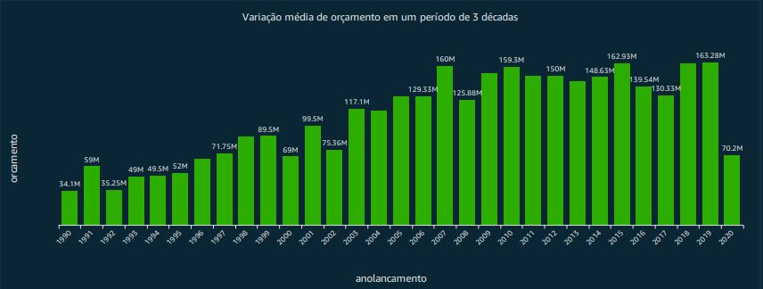

#  **Data & Analytics**

## _Apresentação:_

#### _Desafio: Utilizar o arquivo movies.csv como ponto de partida, complementando com novas informações da API TMDB_ de acordo com o gênero e tema definidos.

## _Contexto do projeto:_

_Orçamento, receita e lucro dos filmes entre 1990 a 2020_  
_Ação e Aventura_
 

1. Qual foi o refinamento que você definiu para sua entrega final?

Neste projeto, desenvolvi dois processamentos, o [primeiro](<../Desafio/etapa-3/tarefa_03/trusted_job_csv.pyrefined_job.py>) na camada trusted com base na carga histórica, por meio de um job, aplicando a transformação necessária, com intuito de filtrar os filmes entre os anos de 1990 a 2020 e utilizar um critério como nota média, para selecionar filmes mais bem colocados.

O [segundo](<../Desafio/etapa-3/tarefa_03/trusted_job_api.py.py>), por meio de outro job, foi selecionar os campos advindos dos dados da API Tmdb selecionando os campos que escolhi.

Por fim, na camada [refined](<../Desafio/etapa-3/tarefa_05/refined_job.py>) juntei todos os campos necessários para a análise e visualização final do dashboard na última etapa.

_Qual a motivação do tema escolhido?_ 

A intenção é trazer e cruzar as informações que acredito serem relevantes e realizar as análises para conclusão do projeto final.

## _Estratégias de desenvolvimento:_

2. Quais foram as etapas do desafio? Como você as desenvolveu? 
Houveram dificuldades? Nos mostre um pouco do código em execução.

_Etapa I. Entender o problema, identificando a análise que gostaria de realizar._

_Etapa II. Buscar os dados que julgo importantes, por meio do processo de ETL, fazendo as requisições pelo site do <a href="https://developer.themoviedb.org/reference/intro/getting-started" target="_blank">TMDB.</a> Duas API's foram utilizadas para chegar no resultado desejado com os seguintes ***endpoints***:_

* https://api.themoviedb.org/3/discover/movie
* https://api.themoviedb.org/3/movie/{movie_id}

_Etapa III Levantar hipóteses, gerar insights relevantes e validá-los nas próximas etapas._

_Etapa IV. Desenvolver o código localmente com as informações/dados obtidos(as) pela API, realizando os testes e posteriormente aplicar o mesmo no serviço <a href="https://aws.amazon.com/pt/lambda/" target="_blank">AWS Lambda</a> e enviar o arquivo gerado com os dados para um bucket no <a href="https://aws.amazon.com/pt/s3/" target="_blank">S3</a>, processo conhecido como ingestão batch._

## _Modelo de Dados:_

3. Como ficou seu modelo de dados? Apresente via diagrama ou utilizando o Glue Catalog. Importante descrever como você imaginou seu modelo dimensional.

Basicamente, imaginei a tabela fato contendo as métricas e medidas quantitativas relacionadas aos filmes, enquanto a tabela de dimensão os detalhes adicionais sobre cada filme, como título, gênero e ano de lançamento. Essas tabelas são conectadas pelo idmovies, permitindo o cruzamento dos dados.

## _Insights:_

**H1. A variação na média de orçamento em um período de três décadas aumentou ou diminuiu e por quê? Quais fatores influenciam?**

**H2. A variação na média de receita em um período de três décadas aumentou ou diminuiu e por quê?**

**H3. Demonstrar o comportamento da média de lucro por gênero**

## _Resultados:_

**H1.** Nota-se uma variação na média de orçamento num período de 30 anos.

Isso explica o fato de que houve avanços tecnológicos, cinematográficos, equipamentos, que exigem investimentos mais altos para alcançar um nível de qualidade e isso reflete em um filme competitivo no mercado.

**H2.**

Nota-se uma tendência na variação média de receita num período de 30 anos, com algumas quedas e logo em seguida uma recuperação.

Esse gráfico demonstra 2 pontos importantes:

1. No ano de 2008, com a crise do Subprime, houve redução de orçamentos para a produção de filmes e isso fez com que investidores ficassem mais cautelosos. Não somente, o consumidor mudou seus hábitos de entretenimento, ou seja, menos gasto com cinema e produtos relacionados.

2. No ano de 2020, nota-se pelo gráfico uma queda forte devido ao fechamento de cinemas a nível mundial pois, as restrições de saúde recomendadas impactaram diretamente na receita de bilheteria, fazendo com que resultasse em atrasos de lançamentos, cancelamentos e redução na produção de novos filmes.

Além disso, houve uma forte mudança para o serviço de Streaming, e isso fez com que os estúdios avaliassem suas estratégias para descobrir novas formas de distrubuir suas produções. 

Por fim, o aumento de custos durante a produção, aconteceu devido à medidas de segurança e protocolos de saúde, resultando em custos adicionais.

**H3.**

Nesse gráfico eu quero apresentar a média de lucro por gênero pra que o investidor possa tomar uma decisão ou não se vale a pena investir em filmes de determinado gênero. Com isso, por meio dessa visualização ele consegue obter uma visão de um possível retorno de lucro e tomar decisões mais assertivas.

## _Feedback - Pessoal/Dificuldades:_

Encontrei diversas dificuldades, desde o desenvolvimento de código, bem como os exercícios de ETL dentro do contexto Glue e API. Não somente, tive voltar atrás algumas vezes para buscar mais dados, executando a lambda novamente.

Tive muito excesso de informações e, é preciso tempo para internalizá-las, gastei muito tempo nos desafios, contornei diversos erros, mas fiquei contente o aprendizado.

Preciso otimizar a gestão do tempo, dividindo melhor as tarefas, e também sempre estar buscando melhorias de código.

## Conclusões Finais:

4. Como você imagina que os conhecimentos obtidos no decorrer do Programa de Bolsas podem gerar valor para os clientes da Compass? 

Imaginei como gerar valor com dados aos clientes desde a compreensão de cada um dos pilares da empresa, bem como o desenvolvimento de conhecimentos técnicos e práticos ao longo do programa.

Assim sendo, posso gerar valor para os clientes da Compass de várias maneiras:

Autonomia e responsabilidade: aprendi a ter capacidade de tomar iniciativa de forma autônoma, garantindo responsabilidade pelos resultados entregues aos clientes.

Colaboração e liderança: trabalhar em equipe, para desenvolver soluções, promovendo um ambiente de cooperação e crescimento mútuo.

Empatia: compreender as necessidades e desafios dos clientes, buscando sempre oferecer soluções adequadas e também um atendimento de alta qualidade.

Proatividade: antecipar às demandas dos clientes, identificar oportunidades de melhoria e implementar ações para otimizar processos e resultados.

Ética e postura profissional: trabalhar com integridade, transparência e ética em todas as conversas com os clientes, garantindo confiança e credibilidade.

**E como todos esses conhecimentos técnicos, práticos e pilares da empresa, reflete na geração de valor com dados para os clientes Compass?**

- Análise de dados: utilizando de análise de dados para identificar padrões, tendências e insights relevantes que possam impulsionar o crescimento do negócio dos clientes.

- Otimização de processos: identificando áreas de oportunidade para reduzir custos, aumentar a eficiência operacional e melhorar a qualidade dos produtos ou serviços oferecidos.

- Tomada de decisão: fornecendo informações estratégicas e análises precisas que auxiliem os clientes na tomada de decisões fundamentadas, contribuindo para o aumento do faturamento, ampliação das vendas e maximização do retorno sobre o investimento.

- Desenvolvimento de soluções personalizadas: criando soluções para as necessidades específicas de cada cliente, garantindo que as estratégias adotadas estejam alinhadas com seus objetivos e metas.