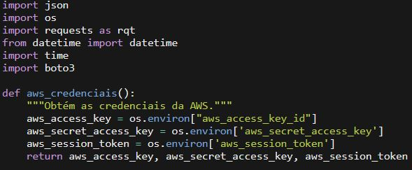
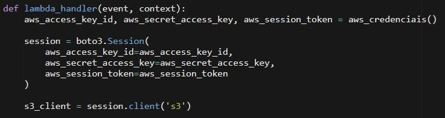
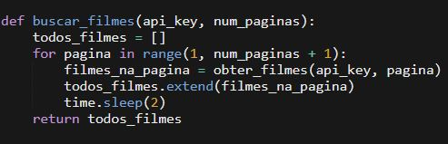
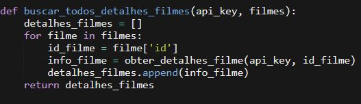
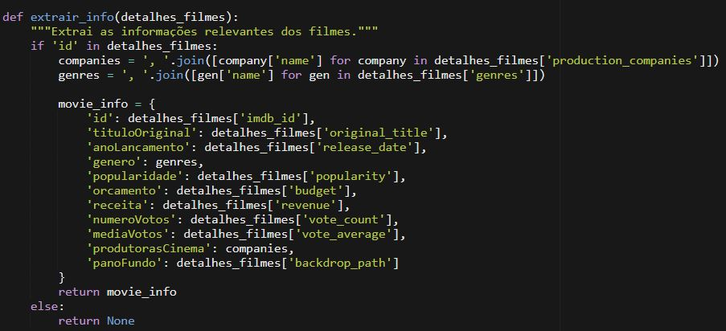
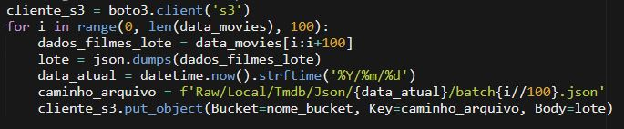
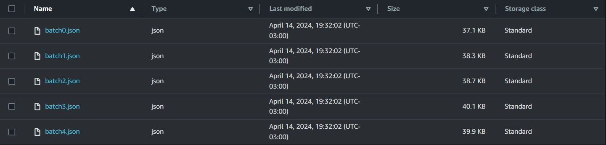

## _Etapas de código:_

Essa etapa do projeto, visa extrair as informações complementares via API e em seguida armazená-las no [_data-lake_](https://aws.amazon.com/pt/big-data/datalakes-and-analytics/what-is-a-data-lake/) hospedado no [_Simple Storage Service (S3)_](https://aws.amazon.com/pt/s3/).

Para realizar esta etapa, utilizei dois serviços, [Lambda](https://aws.amazon.com/lambda/?nc1=h_ls) e S3, conectando ambos da seguinte forma:

Com as keys de acesso administrador, é possível conectar com o S3, criando uma instância usando a [lib Boto3](https://boto3.amazonaws.com/v1/documentation/api/latest/index.html) (biblioteca responsável pela interação com os serviços da AWS usando Python).

Usando o [boto3.client](https://boto3.amazonaws.com/v1/documentation/api/latest/guide/configuration.html):

## _Filtros API:_

Para extrair os dados da API, utilizei dois endpoints, portanto criei duas funções:

A primeira:

A lógica do for é percorrer o número de páginas que escolhi e extrair os filmes com base nos parâmetros de query definidos no endpoint.

Com esse dados em mãos, criei uma segunda função para percorrer os dados coletados na primeira função.

A lógica desse for foi capturar os filmes pelos 'ids' e em seguida extrair as informações para a análise que quero realizar na fase final.

Para salvar os lotes no S3 usei a função [put_object](https://docs.aws.amazon.com/AmazonS3/latest/API/API_PutObject.html) da biblioteca *Boto3* para enviar os arquivos gerados para o bucket.

Lotes de 100 registros no S3:

