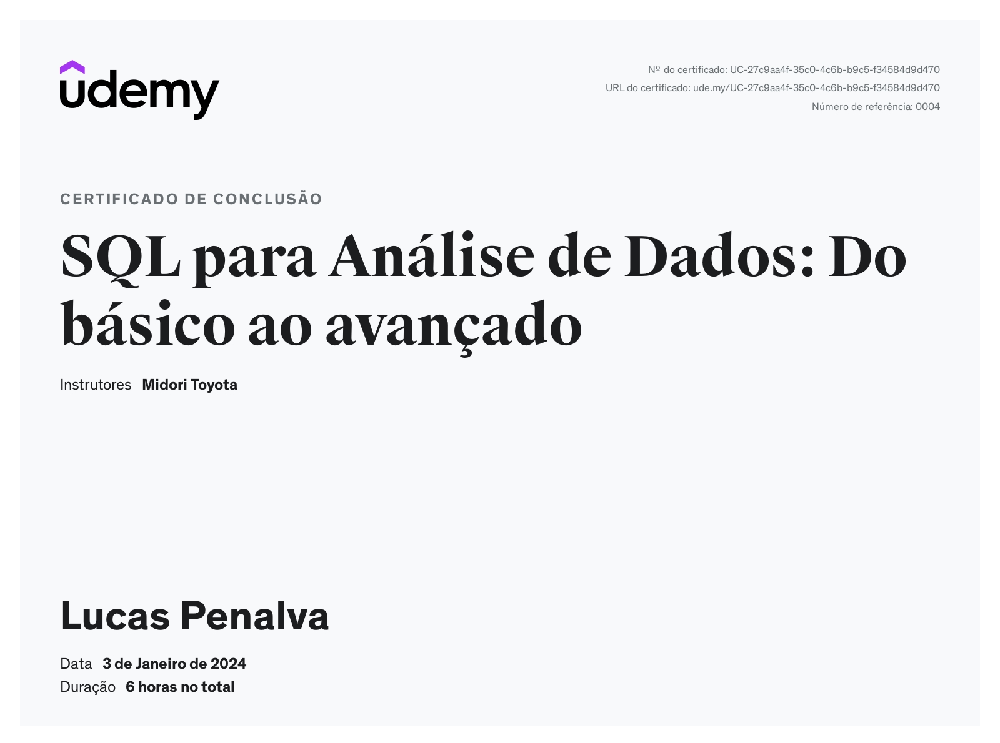
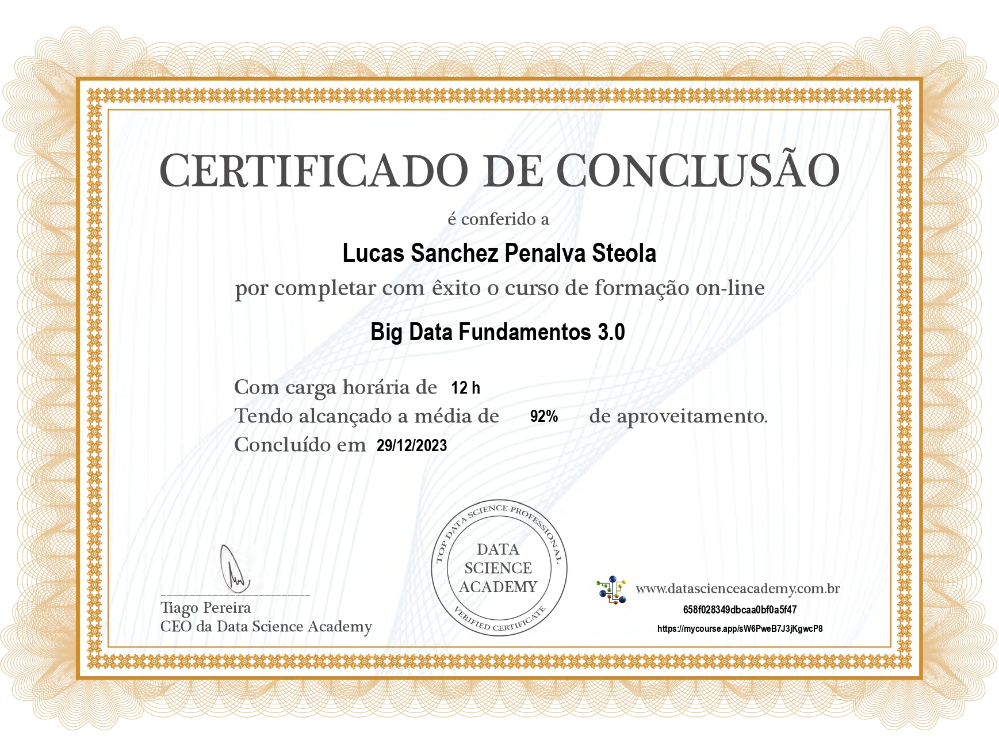

## Aprendizados

### Big Data

Na Sprint 2, aprendemos amplamente o conceito de Big Data e sua aplicação em projetos de ciência de dados. Foi explicado como devemos armazenar os dados, e todo o funcionamento na criação de um sistema DataWarehouse, DataLake e DataStores, bem como suas principais vantagens e benefícios.

Além disso, compreendemos a importância da organização de máquinas em clusters, os quais realizam o processamento em paralelo dos dados por meio de um software chamado Apache Hadoop, responsável pela gestão do cluster e pela definição de como os arquivos serão distribuídos.

Adicionalmente, explanamos o conceito de Cloud Computing, e seus principais provedores em nuvem, tal como a AWS e sua atuação na cloud.

Ademais, estudamos também os conceitos de Machine Learning e fluxo de trabalho(pipeline), de todos os processos envolvidos, iniciando pela preparação dos dados, construção e treinamento do modelo e deploy. Em seguida, distinguimos as definições do papel de um DevOps, MLOps, e DataOps.

Por fim, entendemos como as empresas utilizam o serviço de dados de forma estratégica(gerenciando), objetivando alavancar os dados como um ativo de negócios para melhor tomada de decisões. Assim sendo, foi apresentado também todo o processo de extração, transformação e carregamento dos dados.

### SQL

 No curso de SQL, desenvolvemos o conhecimento da sintaxe da linguagem SQL. Aprendemos de forma prática como escrever e executar queries. Criamos tabelas e manipulamos, visando a consulta de dados em um bando de dados, que simula situações muito próxima à realidade das empresas.

<!--# Exercícios

1. ...
[Resposta Ex1.](exercicios/ex1.txt)

2. ...
[Resposta Ex2.](exercicios/ex2.txt)

# Evidências

Ao executar o código do exercício ... observei que ... conforme podemos ver na imagem a seguir:

-->

## Certificados

_SQL para Análise de Dados_

_Certificado Big Data Fundamentos_

