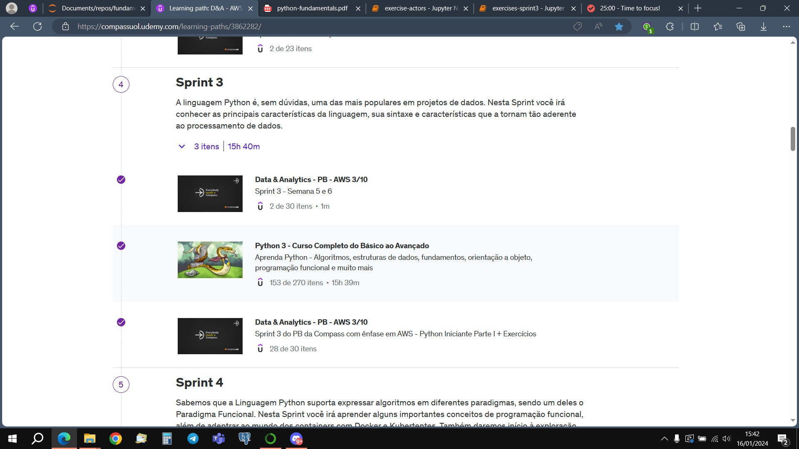
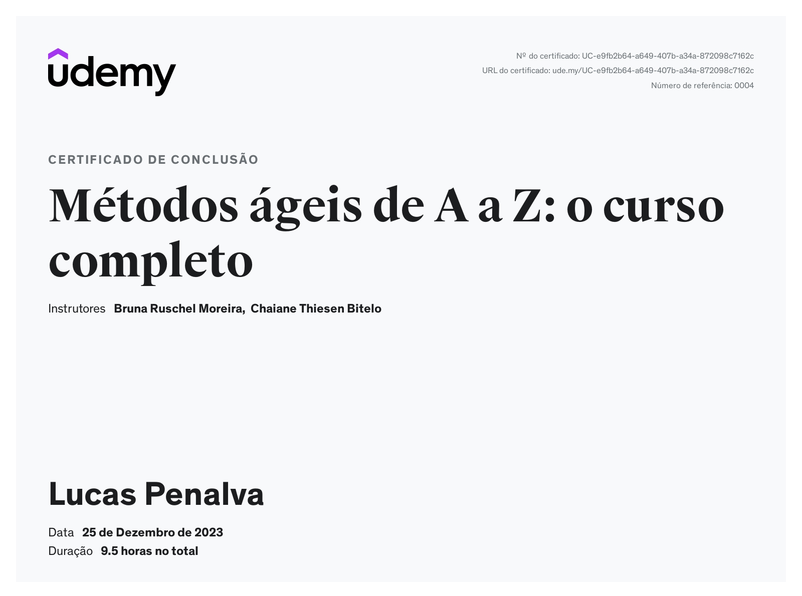
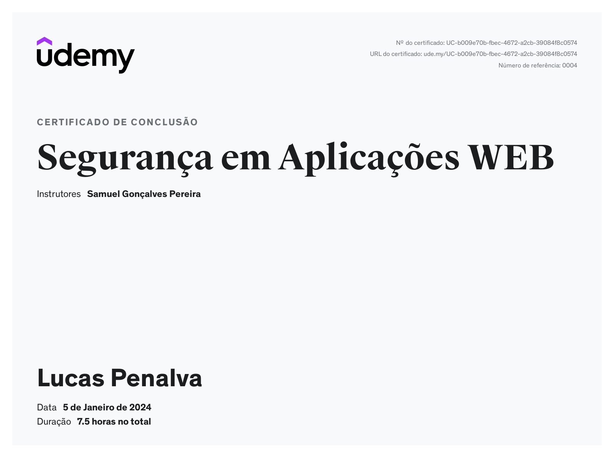

<!--## Aprendizados

# Exercícios

1. ...
[Resposta Ex1.](exercicios/ex1.txt)

2. ...
[Resposta Ex2.](exercicios/ex2.txt)

# Evidências

Ao executar o código do exercício ... observei que ... conforme podemos ver na imagem a seguir:

-->

## Certificados

_Certificado Python_

_Certificado Métodos Ágeis_

_Certificado Segurança em Web_

