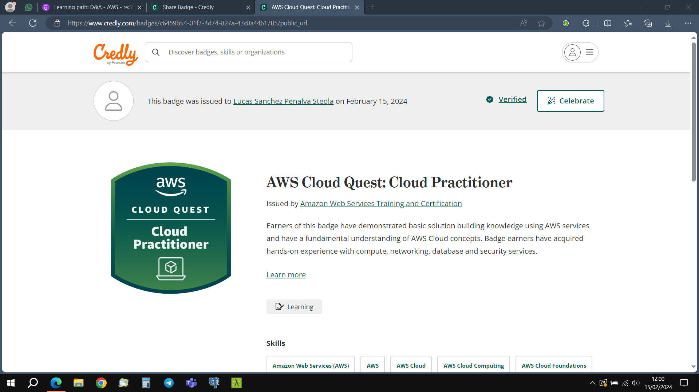
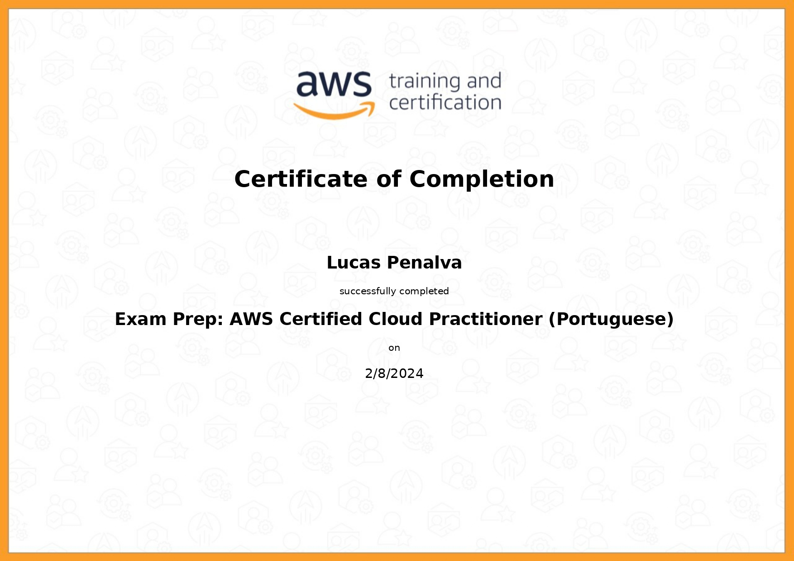
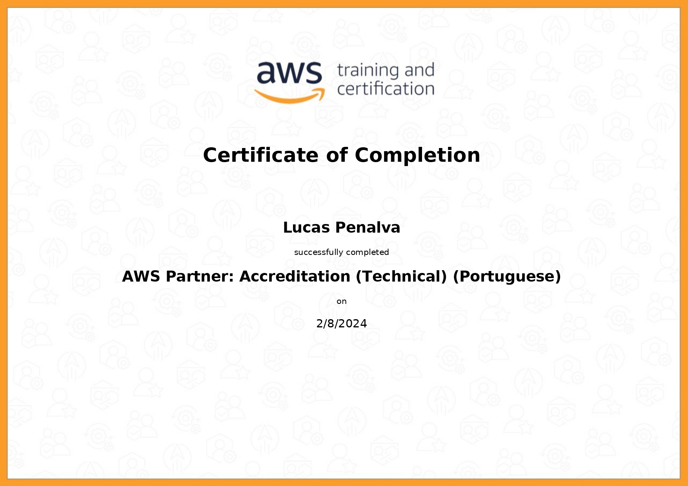
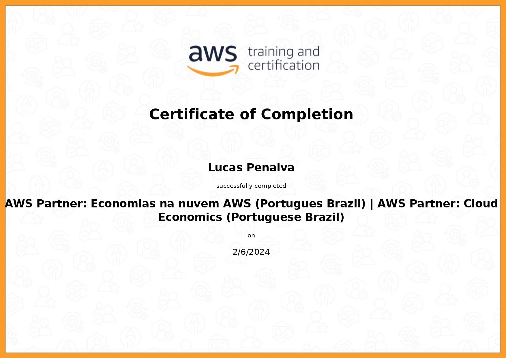
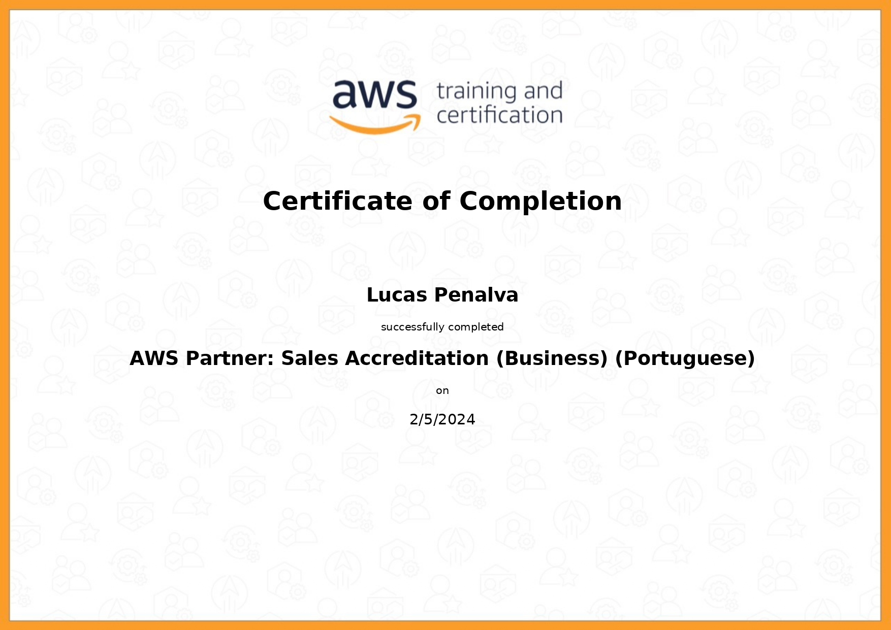

## Aprendizados

Durante esta sprint, foi desenvolvido conhecimentos para serem aplicados no exame da Cloud Practitioner da AWS.

<!--# Exercícios

1. ...
[Resposta Ex1.](exercicios/ex1.txt)

2. ...
[Resposta Ex2.](exercicios/ex2.txt)

# Evidências

Ao executar o código do exercício ... observei que ... conforme podemos ver na imagem a seguir:

 -->

## Certificados

_Certificado AWS Cloud Quest_

_Certificado AWS Cloud Practitioner_

_Certificado AWS Accreditation Technical_

_Certificado Cloud Economics_

_Certificado Sales Accreditation_

