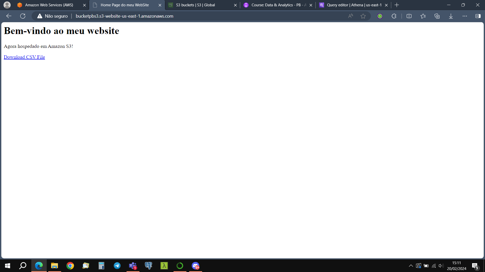
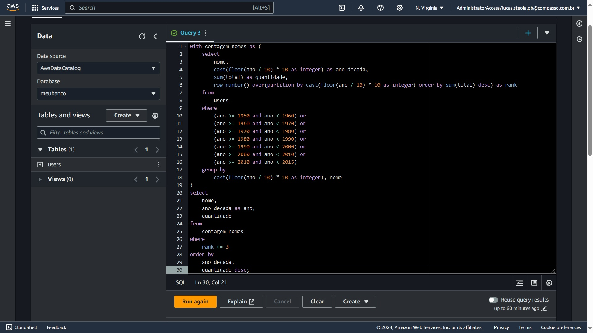
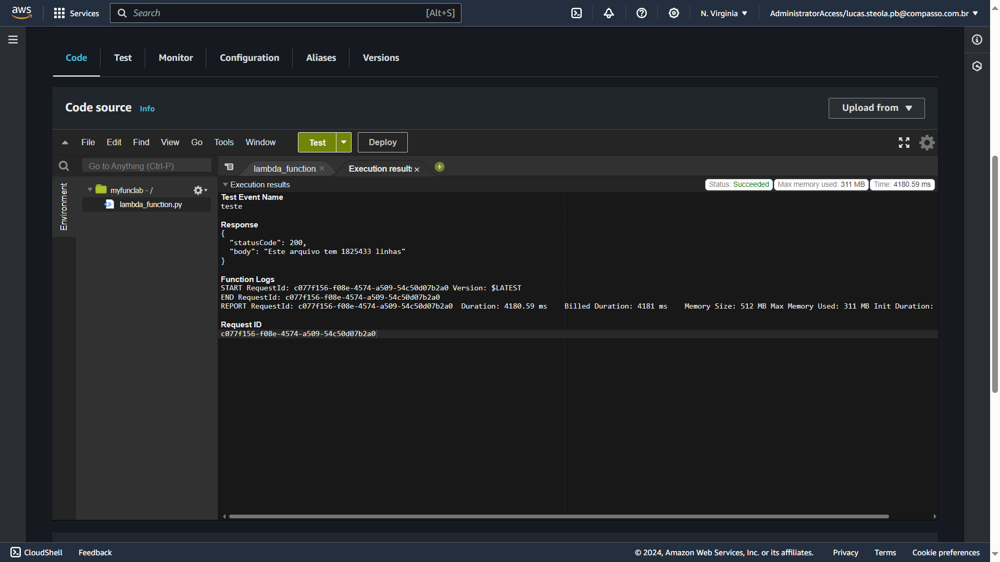

## Aprendizados

Durante esta sprint, foram desenvolvidos conhecimentos teóricos e práticos, de alguns dos principais serviços da AWS, tais como, Amazon S3, Amazon Athena e Lambda.

## Evidências

_Website hospedado no Amazon S3_

_Query Final_

_Função lambda criada e adicionada uma camada (layer) para aplicação final_

