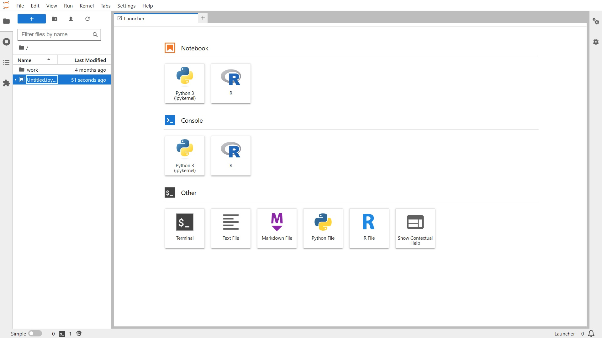

## Aprendizados

Durante esta sprint, foram desenvolvidos conhecimentos teóricos e práticos sobre o Hadoop, o qual é um framework de distribuição computacional, desenvolvido e mantido pela Apache Software Foundation. O Hadoop é formado por dois componentes, o primeiro, chamado HDFS que é um sistema de arquivos que gerencia todo o armazenamento de dados, já o segundo conhecido como MapReduce, é um framework que processa dados em múltiplos servidores.

No curso de Spark, conhecemos a arquitetura de distruibuição, a qual permite processar dados utilizando paralelismo e memória. O Spark, é uma ferramenta poderosa de processamento de dados (principalmente em grandes volumes). Todo esse processamento, ocorre dentro de um cluster. Aprendemos também, o desenvolvimento de banco de dados, tabelas, consultar dados com Spark SQL, criar views e fazer joins. Não somente, criamos aplicações via linha de comando. 

## Evidências

_Hadoop_

_Formação Spark com Python_

## Tarefa 1 - Pandas

Na tarefa 1, foram respondidas algumas perguntas de negócio, utilizando a biblioteca Pandas.

[Clique aqui para visualizar os resultados](<./evidencias/tarefa_01/exercicios-pandas.ipynb>)

## Tarefa 2 - Contador de Palavras

### _Etapas_

***1. Utilizar o comando 'docker pull jupyter/all-spark-notebook para criar a imagem do container.***

***2. Utilizar o comando 'docker run -it -p na porta 8888:8888. O comando docker run -it -p é usado para criar e executar um contêiner Docker interativo a partir de uma imagem específica. Com isso, é fornecido um login e um token para acessar o JupyterLab.***

***3. Por fim, foi utilizado a linguagem spark importando o módulo pyspark para o desenvolvimento de uma aplicação que conta o número de palavras em um arquivo README.md***

_[Resultado Final](<./evidencias/tarefa_02/spark-counter.ipynb>)_

## Laboratório AWS - Glue

Neste laboratório, utilizamos o AWS - Glue, um serviço ETL (Extract/Transformation/Loading), responsável pela transformação, organização, limpeza e carregamento de dados. Nele, conseguimos por meio de um bucket, banco de dados, extrair informações utilizando dados de diversos formatos e origens.

Todos os scripts desenvolvidos podem ser encontrados [aqui](<./evidencias/aws-glue-lab/>) com suas respectivas saídas.

Já os "crawlers", são ferramentas que automatizam o mapeamento de dados em fontes de dados, como armazenamentos de arquivos ou bancos de dados. Eles analisam essas fontes de dados, identificam a estrutura dos dados e criam ou atualizam automaticamente os metadados no catálogo do AWS Glue. Isso faz com que o Glue entenda a estrutura dos dados e forneça informações valiosas para tarefas como transformações de dados, consulta e análise. Em suma, os crawlers simplificam e automatizam os processos de gerenciamento de dados.

## Tarefa 3 - Desafio - Parte I

[Visualizar desafio P1](<../Desafio/README.md>)

## Feedback Pessoal

Encontrei diversas dificuldades, desde o desenvolvimento de código, bem como os exercícios de ETL dentro do contexto Glue. 

Tive muito excesso de informações e, é preciso tempo para internalizá-las, gastei muito tempo no desafio, contornando diversos erros, mas fiquei contente o aprendizado.

Preciso otimizar a gestão do tempo, dividindo melhor as tarefas, e também sempre estar buscando melhorias de código.